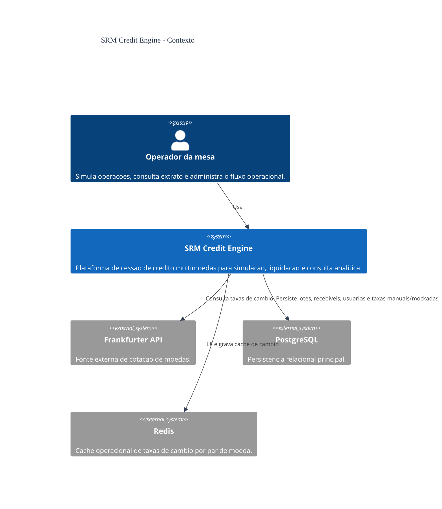
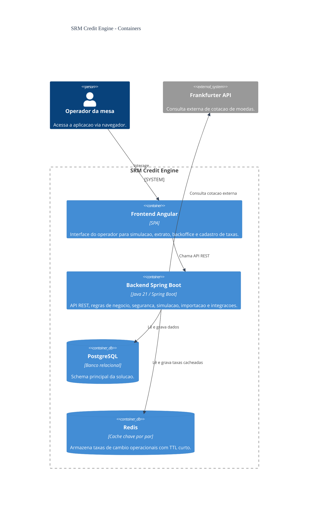

# Diagrama C4 - V2

Este diretório guarda a documentação C4 da solução alinhada ao estado final da aplicação
## Nivel 1 - Contexto

## Nivel 2 - Container

## Leitura rapida

- o frontend e uma SPA Angular separada do backend
- o backend concentra a orquestracao das regras de negocio
- PostgreSQL permanece como persistencia relacional principal
- Redis atua como cache operacional da taxa de cambio
- Frankfurter permanece como integracao externa de cotacao
