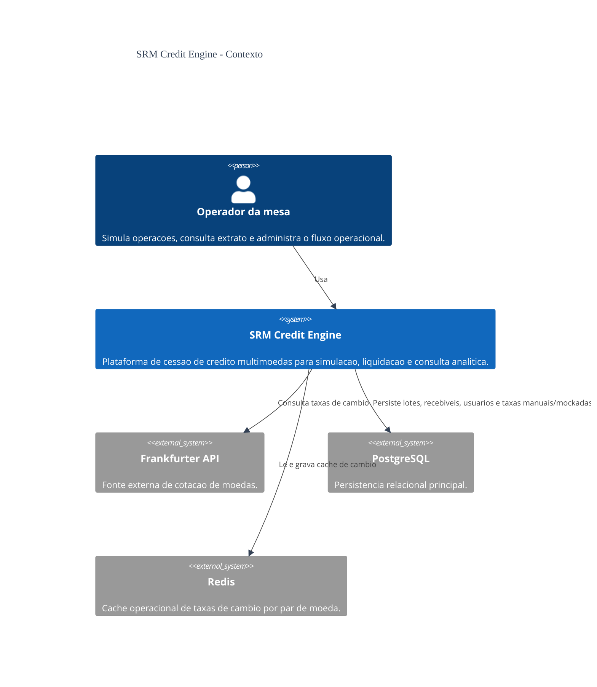
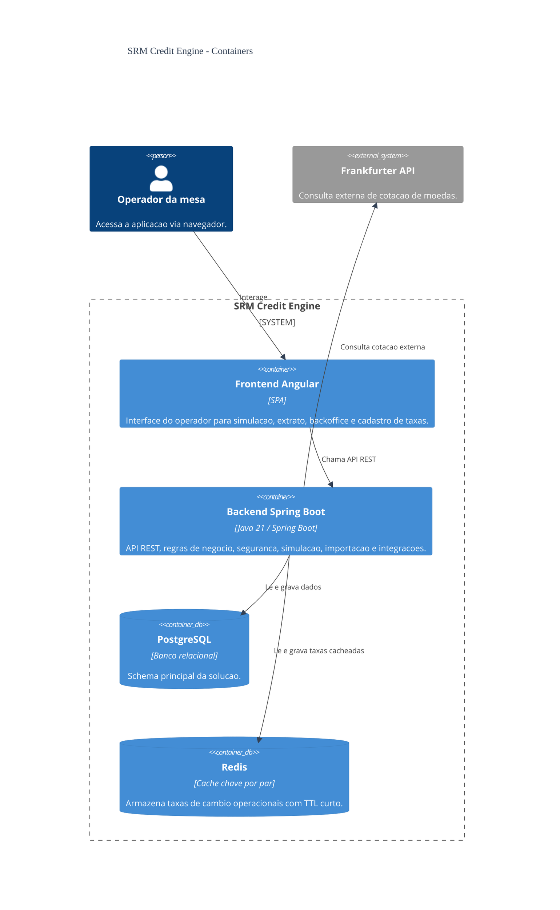

# Diagrama C4 - V1 Educacional

Este diretório clona a visão C4 da solução e adiciona os niveis 3 e 4 para fins educacionais.
O conteudo abaixo reflete a estrutura atual do backend e serve como material de estudo, nao como contrato formal adicional da entrega.

## Nivel 1 - Contexto

## Nivel 2 - Container

## Nivel 3 - Componentes do Backend

```mermaid
%%{init: {"theme":"base","themeVariables":{"background":"#f8fafc","primaryColor":"#ffffff","secondaryColor":"#ffffff","tertiaryColor":"#ffffff","primaryBorderColor":"#cbd5e1","secondaryBorderColor":"#cbd5e1","tertiaryBorderColor":"#cbd5e1","lineColor":"#64748b","fontColor":"#334155","primaryTextColor":"#334155","secondaryTextColor":"#334155","tertiaryTextColor":"#334155","edgeLabelBackground":"#ffffff","edgeLabelColor":"#334155","fontFamily":"Inter, Arial, sans-serif"}}}%%
C4Component
title SRM Credit Engine - Componentes do Backend

Container_Boundary(api, "Backend Spring Boot") {
  Component(authController, "AuthController", "REST Controller", "Recebe login e emite token JWT.")
  Component(pricingController, "PricingSimulationController", "REST Controller", "Exponibiliza a simulacao de precificacao.")
  Component(exchangeController, "ExchangeRateController", "REST Controller", "CRUD de taxas de cambio.")
  Component(batchController, "BatchImportController", "REST Controller", "Importacao de lotes via CSV.")
  Component(settlementStatementController, "SettlementStatementController", "REST Controller", "Consulta extrato de liquidacao.")
  Component(settlementOperationController, "SettlementOperationController", "REST Controller", "Liquida, rejeita e reabre operacoes.")

  Component(pricingAppService, "PricingSimulationApplicationService", "ApplicationService", "Orquestra a simulacao.")
  Component(exchangeQueryService, "ExchangeRateQueryService", "ApplicationService", "Resolve taxa operacional de cambio.")
  Component(exchangeAdminService, "ExchangeRateAdministrationApplicationService", "ApplicationService", "Administra taxas manuais e mockadas.")
  Component(batchImportService, "BatchImportApplicationService", "ApplicationService", "Importa lotes e gera credit_assignments.")
  Component(settlementStatementService, "SettlementStatementApplicationService", "ApplicationService", "Consulta analitica de liquidacoes.")
  Component(settlementOperationService, "SettlementOperationApplicationService", "ApplicationService", "Muda status e controla a operacao.")
  Component(currencyQueryService, "CurrencyQueryService", "ApplicationService", "Consulta moedas cadastradas.")

  Component(receivablePricingService, "ReceivablePricingService", "Domain Service", "Aplica precificacao e conversao cross-currency.")
  Component(strategyResolver, "PricingStrategyResolver", "Domain Service", "Seleciona estrategia por tipo de recebivel.")
  Component(commercialStrategy, "CommercialReceivablePricingStrategy", "Strategy", "Regra de spread da duplicata mercantil.")
  Component(checkStrategy, "PostDatedCheckPricingStrategy", "Strategy", "Regra de spread do cheque pre-datado.")

  Component(exchangeQuoteClient, "FrankfurterExchangeRateClient", "Integration Client", "Consulta a API externa com retry e circuit breaker.")
  Component(exchangeCacheClient, "RedisExchangeRateCacheClient", "Cache Client", "Le e grava taxa por par no Redis.")
  Component(exchangeRefreshJob, "ExchangeRateRefreshJob", "Scheduled Job", "Atualiza o cache operacional periodicamente.")
  Component(jwtService, "JwtTokenService", "Security Service", "Gera e valida JWT.")
  Component(jwtFilter, "JwtAuthenticationFilter", "Security Filter", "Autentica requests com token.")
  Component(apiExceptionHandler, "ApiExceptionHandler", "Exception Handler", "Normaliza respostas de erro.")
  Component(requestCorrelationFilter, "RequestCorrelationFilter", "Filter", "Propaga correlationId e transactionId.")

  Component(currencyRepo, "CurrencyJpaRepository", "Repository", "Persistencia de moedas.")
  Component(exchangeRepo, "ExchangeRateJpaRepository", "Repository", "Persistencia de taxas.")
  Component(assignorRepo, "AssignorJpaRepository", "Repository", "Persistencia de cedentes.")
  Component(batchRepo, "CreditBatchJpaRepository", "Repository", "Persistencia de lotes.")
  Component(assignmentRepo, "CreditAssignmentJpaRepository", "Repository", "Persistencia de recebiveis.")
  Component(statementReadRepo, "JdbcSettlementStatementReadRepository", "Read Repository", "Consulta do extrato.")
  Component(operationReadRepo, "JdbcSettlementOperationReadRepository", "Read Repository", "Consulta operacional para backoffice.")
}

Rel(authController, jwtService, "Solicita token")
Rel(pricingController, pricingAppService, "Executa simulacao")
Rel(exchangeController, exchangeAdminService, "Gerencia taxas")
Rel(batchController, batchImportService, "Importa lote")
Rel(settlementStatementController, settlementStatementService, "Consulta extrato")
Rel(settlementOperationController, settlementOperationService, "Liquida ou altera status")

Rel(pricingAppService, receivablePricingService, "Orquestra")
Rel(pricingAppService, exchangeQueryService, "Resolve taxa")
Rel(exchangeQueryService, exchangeCacheClient, "Lê Redis")
Rel(exchangeQueryService, exchangeRepo, "Fallback em dados manuais/mockados")
Rel(exchangeAdminService, exchangeRepo, "CRUD manual/mockado")
Rel(batchImportService, currencyQueryService, "Valida moedas")
Rel(batchImportService, exchangeQueryService, "Calcula taxa aplicada")
Rel(batchImportService, assignmentRepo, "Persiste itens do lote")
Rel(batchImportService, batchRepo, "Persiste lote")
Rel(batchImportService, assignorRepo, "Persiste cedente")
Rel(settlementStatementService, statementReadRepo, "Consulta analitica")
Rel(settlementOperationService, operationReadRepo, "Consulta operacional")
Rel(settlementOperationService, assignmentRepo, "Atualiza status")
Rel(receivablePricingService, strategyResolver, "Seleciona estrategia")
Rel(strategyResolver, commercialStrategy, "Resolve Duplicata Mercantil")
Rel(strategyResolver, checkStrategy, "Resolve Cheque Pre-datado")
Rel(exchangeQuoteClient, exchangeCacheClient, "Popula cache")
Rel(exchangeRefreshJob, exchangeQuoteClient, "Busca cotacao externa")
Rel(exchangeRefreshJob, exchangeCacheClient, "Grava cache")
Rel(jwtFilter, jwtService, "Valida token")
Rel(apiExceptionHandler, authController, "Normaliza erro de login")
Rel(requestCorrelationFilter, apiExceptionHandler, "Registra contexto de request")
```

## Leitura rapida

- L1 mostra o contexto de negocio e integracoes externas
- L2 mostra os containers reais da solucao
- L3 detalha os principais componentes do backend
